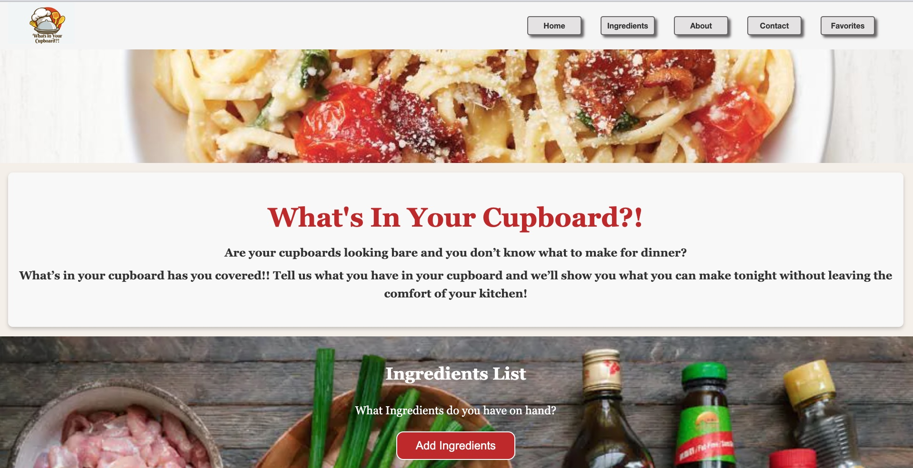
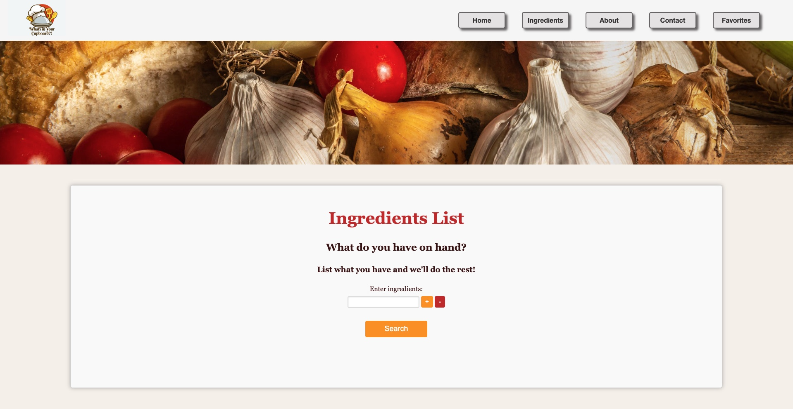
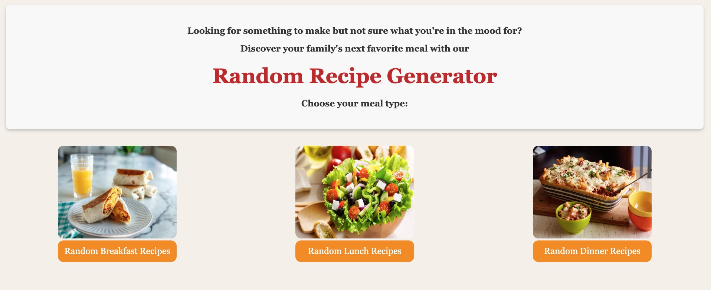
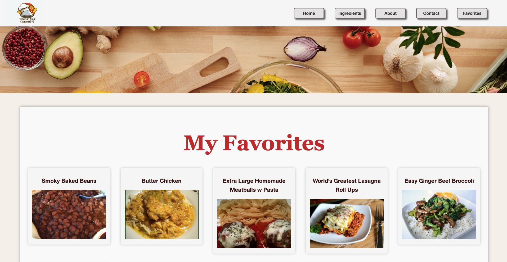

# 🥘 What's In Your Cupboard?!🥗

Welcome to **What's In Your Cupboard?!**, a user-friendly recipe website designed for busy individuals, especially moms who balance work, learning, and family life. This project is the first of many to come from my learning journey at [Get Coding](https://www.getcodding.ca/).

## Live Demo: [What's In Your Cupboard?!](https://www.loom.com/share/dfaeee2a52e24e318037168229c1a9c8?sid=6d043e6b-03d6-4bb8-aa78-a1e0adf76195)

## 🥣 Overview

**What's In Your Cupboard?!** aims to alleviate the everyday stress of meal planning. It's perfect for those evenings when you're unsure what to cook with the limited ingredients at hand. No more last-minute grocery store runs or staring into your fridge wondering what to make!

   

## 🌟 Features

- **Ingredient-based Recipe Suggestions**: Enter the ingredients you have, and we'll suggest a recipe you can make right away.
- **Random Recipe Generator**: Spice up your meals with new and exciting recipe ideas.
- **Favorites Page**: Save your liked recipes, creating your personalized digital cookbook.

## 💻 Built With

- **HTML**: Structured the content of my website.
- **CSS**: Styled and brought life to the website's design.
- **JavaScript**: Added interactivity, managing the recipe suggestions, and the favorites feature.

## 💡 Inspiration

This project was born out of my personal need as a full-time working mom and student. The goal was to create a tool that makes life easier for anyone who finds 24 hours insufficient to juggle daily responsibilities.

## 🔍 How It Works

1. **User Input**: Input the ingredients you already have at home.
2. **Recipe Suggestion**: Our algorithm suggests recipes based on your ingredients.
3. **Random Recipes**: Get inspired by our random recipe generator for new meal ideas.
4. **Save Favorites**: Like a recipe? Save it to your favorites for future reference.

## 🙏 Acknowledgments

- **Lucas Hillier**: My coach at Get Coding NL, whose guidance was invaluable in the creation of this project.
- **My Family**: For their patience and support as I embarked on this learning journey.

## 👩‍💻 About the Developer

I'm Amanda Frost, a student at [Get Coding](https://www.getcoding.ca/), a full-time worker, and a dedicated mom. At 44, I dove into the world of web development, proving that it's never too late to start a new chapter in life!

## 👋 Connect with Me

- **LinkedIn:** [Amanda Frost](https://www.linkedin.com/in/amanda-frost-51833629a/)
- **GitHub:** [@AmandaFrost](https://github.com/Amandafrost79/Amandafrost79.git)

---

Ⓒ 2024 Amanda Frost | Passionate Developer | Lifelong Learner
